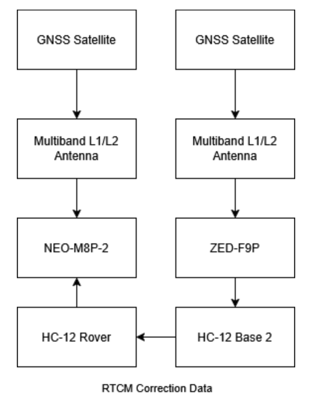
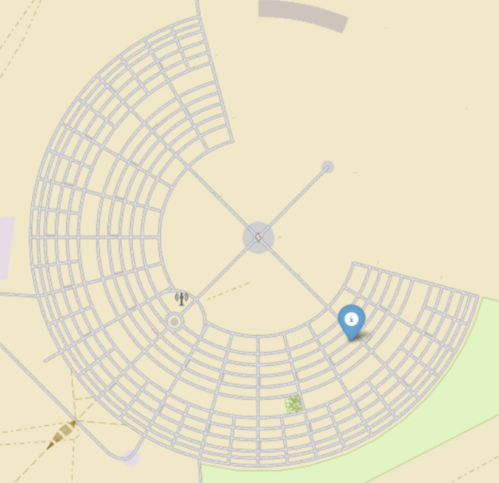

==========
Navigation
==========

For RoboFlock to follow the user, they must be holding a beacon. This beacon is a portable-handheld device that acts as a homing system for the robot, and the robot will follow within a few meters to the best of its ability in an outdoor environment. The beacon consists of a battery system, GPS module, wireless radio frequency (RF) communication module, and LEDs (for a little flare). It will also alert the user if the robot has any problems, such as getting stuck or low battery power. Both the robot's and the beacon's GPS modules are configured to receive Global Navigation Satellite System (GNSS) latitude, longitude, and altitude data and Global Navigation Satellite System (GLONASS) satellite constellations. 

Architectural Block Diagram
+++++++++++++++++++++++++++

.. @todo: Update figure

    Figure 5: Block Diagram for the Beacon to Rover Correction Data Stream

Tracking Functionality
++++++++++++++++++++++

The main idea behind the tracking system is that the beacon broadcasts its GPS coordinates to RoboFlock, which then uses this information in tandem with its own coordinates to determine which direction to move. 

Tre are two major transformations regarding RoboFlock's positioning and movement. 

* :code:`map->odom` - Uses the latitude and longitude representing the "real world" position and converts to RoboFlock's local coordinate system.

* :code:`odom->base_link` - Represents RoboFlock's spatial and rotational position based on LiDAR and IMU data. 

These transformations provide a smooth local frame of reference as the robot moves around its environment. The main package used for this process is :code:`robot_localization`, which can take in multiple streams of sensor data for sensor fusion (combination of data). The package uses an *Extended Kalman Filter* to obtain precise odometry data and reduce error introduced by individual sensors. For example, the IMU and GPS data fusion helps mitigate drifting acceleration measurements and discrete jumps in latitude and longitude.

RoboFlock receives a stream of National Marine Electronics Association (NMEA) Global Positioning System Fix Data (GGA) messages from the beacon, specifically the latitude, longitude, and altitude fields of the message (`See GGA, RMC, and GLL NMEA Sentence Structure <https://tavotech.com/gps-nmea-sentence-structure/>`_). These values are transformed to RoboFlock's global frame of reference and subsequently published for Nav2 to use while waypoint following.

GPS Visualization Simulation
++++++++++++++++++++++++++++

As an intermediate step between testing and fully implementing the GPS visualization functionality, we simulated the expected outputs from the beacon and robot GPS modules to the Jetson Orin Nano. By simulating this network traffic under assumption of NMEA formatted data, we wrote a script in Python that extracts latitude and longitude information from each module’s raw NMEA data stream. Using this positional information, we can visualize the location of the robot and the beacon on a map using the `Folium mapping library <https://folium.readthedocs.io/en/latest/>`_.

    Figure 6: Example of GPS Visualization of Robot's Position on Map of Black Rock City (Burning Man Site)

