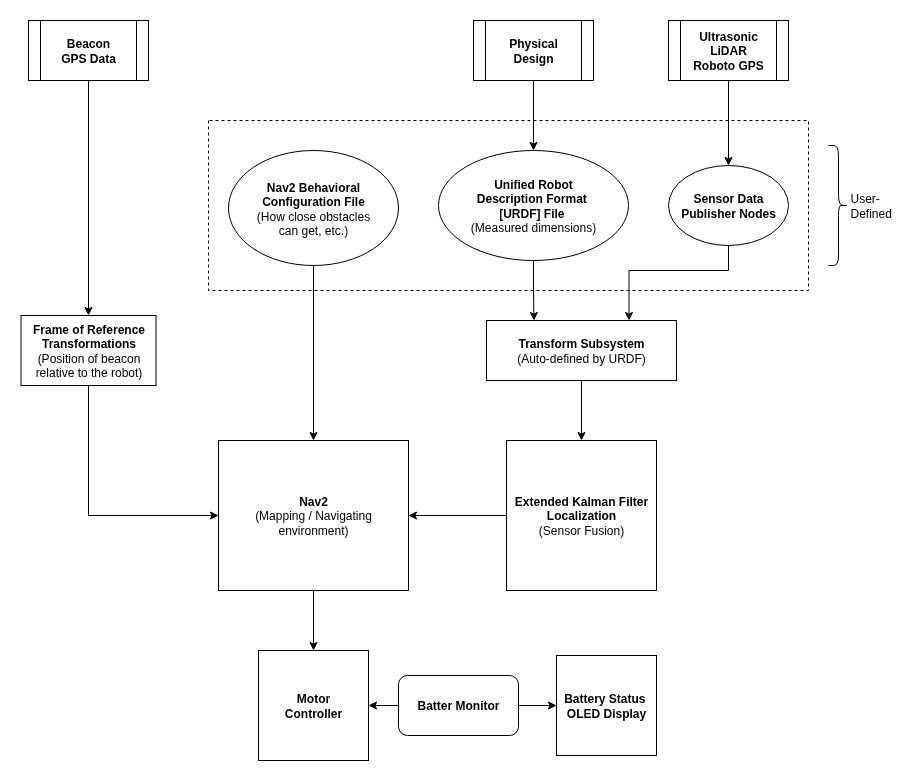

ROS2
====

ROS2 is the main software framework for the robot. It handles message passing, timing, and modularity. Each sensor, controller, and algorithm runs as a ROS2 node. These nodes will use one of the following communication methods provided by the framework:

1. *Topics* are used for continuous streams of data. Nodes can publish messages via topics and nodes can subscribe to messages via topics.

2. *Services* are used for call-and-response communication. Many nodes can act as the service client, each capable of sending requests to the node acting as the service server.

.. @todo: Wrong
.. Simpler tasks, such as collecting the ultrasonic data or telling the motors how fast to move, will be communicated via topics. More complex tasks, such as obtaining the beacon’s location, will be communicated via services.

Architectural Block Diagram
^^^^^^^^^^^^^^^^^^^^^^^^^^^

    Figure 11: Overview of ROS2 Setup

Perception and Planning
^^^^^^^^^^^^^^^^^^^^^^^

The LiDAR node publishes range data at its native scan rate and the ultrasonic node publish short range distance readings. This data will be used build a map of the surrounding environment via Nav2, a submodule of ROS2.

Nav2 builds a local cost map from the LiDAR and ultrasonic data, showing both free space and blocked space around the robot. This map is updated at a high rate, giving it smooth motion around obstacles, even when they appear without warning. Nav2 can be configured to react in certain ways depending on the proximity of an obstacle (e.g., full stop when an obstacle is less than 15 centimeters away).

The two GPS nodes publish their coordinate data, which is used by Nav2 to compute a target waypoint from the GPS position of the beacon. The appropriate velocities needed for the motors to go in the direction of the user are determined by Nav2 using the spatial difference between the two points and the local cost map. The motor controller node accepts these velocity commands and converts them into valid input signals for the ESCs.
