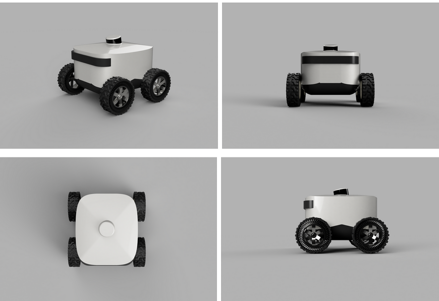
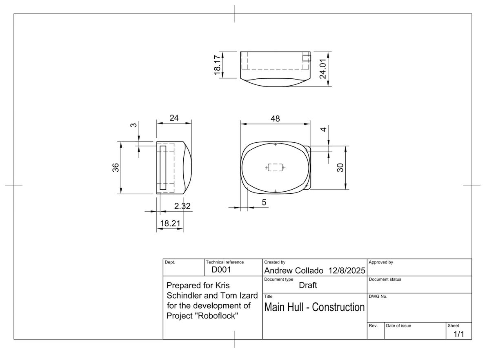

Chassis Design
==============

The chassis is designed around a rounded “delivery-robot” form similar to the reference image, with an upper pod and a lower hull mounted on a custom designed frame. It supports the LiDAR, ultrasonic sensors, battery, Jetson Orin Nano, and wiring while maintaining high ground clearance and stability for outdoor environments like Burning Man.

Design Objectives
^^^^^^^^^^^^^^^^^

- **Stable Sensor Integration:** Provide a clear 360° view for the LiDAR and fixed forward placement for the ultrasonic sensors.

- **Electronics Accommodation:** Include protected internal spaces and organized cable routing for the Jetson Orin Nano, ESC, GPS, and UWB modules.

- **Outdoor Operation:** Maintain a rigid structure, good impact resistance, and a low center of gravity for rough terrain.

- **Modularity for Future Teams:** Use a fully parametric Fusion design so dimensions, mounts, and structural features can be easily updated.

Fabrication Plan
^^^^^^^^^^^^^^^^

The fabrication will occur in two major phases:

*Phase 1: 3D-Printed Prototype (Spring 2026)*

The first full chassis prototype will be fabricated using large-format 3D printing. This approach provides:

- **Rapid iteration:** Components can be reprinted quickly as sensor locations or wiring requirements change.

- **Low material cost:** Prototyping-grade plastics allow experimentation with geometry and structure.

- **Testing flexibility:** Mounting brackets, electronics trays, and sensor housings can be modified easily to validate performance in field tests.

The prototype will validate:

- Ground clearance

- LiDAR scan stability

- Ultrasonic sensor field-of-view alignment

- GPS reception (minimizing RF interference from structural components)

- Weight distribution under load

*Phase 2: Machined Final Chassis (Future Team)*

Following successful testing of the 3D-printed version, the final chassis will be optimized for CNC machining and fabricated from lightweight metals such as aluminum. This future iteration will offer:

- Improved structural strength

- Resistance to UV, heat, and deformation

- Tighter mechanical tolerances

- Enhanced durability for long-term outdoor operation

Our Fusion design files will include fully constrained sketches, an updated bill of materials, and annotated 2D drawings so the next team can transition directly into fabrication without re-engineering the system.

Integration with Mechanical Components
^^^^^^^^^^^^^^^^^^^^^^^^^^^^^^^^^^^^^^

The chassis interfaces with the drivetrain and motors listed in :doc:`Appendix A <../citation_docs/appendix_a>`. It includes:

- Reinforced compartments for the 3S 6000mAh LiPo battery

- ESC and brushed motor integration for reliable power delivery

- Cable routing channels to isolate motor noise from sensor wiring

    Figure 12: Chassis Design Prototype

.. figure:: ../_images/fig13_chassis_frame.png
    :align: center
    :width: 50%
    :loading: link

    Figure 13: Chassis Custom Frame

.. figure:: ../_images/fig14_chassis_frame_dims.png
    :align: center
    :width: 50%
    :loading: link

    Figure 14: Chassis Frame Dimensions

.. figure:: ../_images/fig15_chassis_shell.png
    :align: center
    :width: 50%
    :loading: link

    Figure 15: Chassis Shell with Electronics Storage Space

    Figure 16: Chassis Shell Dimensions

.. figure:: ../_images/fig17_airless_tires.png
    :align: center
    :width: 50%
    :loading: link

    Figure 17: Airless Wheels and Tires

.. figure:: ../_images/fig18_airless_tires_dims.png
    :align: center
    :width: 50%
    :loading: link

    Figure 18: Airless Wheel and Tire Dimensions