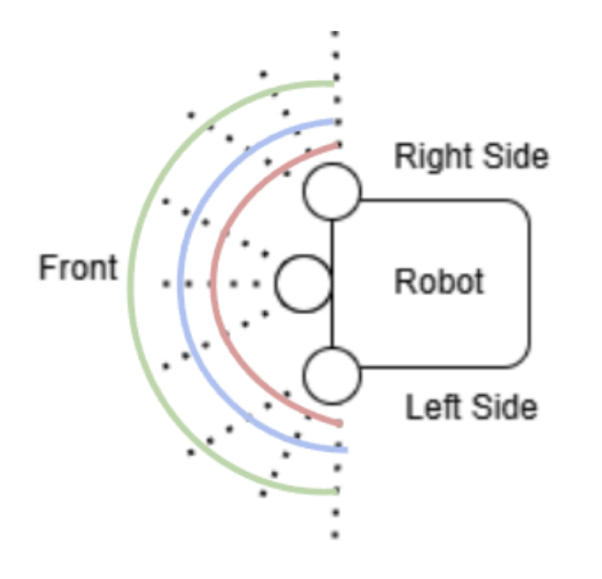

Step-by-Step Construction Guide
===============================

The chassis must be fabricated and assembled before drivetrain integration, because the motors, axle pivot points, battery compartment, sensors, and mounts all depend on chassis mounting geometry.

The prototype chassis should be 3D printed as originally planned under the section Chassis Design. We will be making a directory with all necessary files. 

Step 1 - Chassis
^^^^^^^^^^^^^^^^

Print the lower structural frame in multiple joined pieces using large-bed printers if possible. Reinforce the joints using threaded inserts and screws through bridge plates.

Confirm mounting holes align for the antenna mounts, motor mounting plate locations, axle pivot brackets, and LiDAR top mounting plate.

Install the axle pivot structure using the two provided double-shear brackets in the noted areas.

Print the shell shown in figure 15-16 which has an internal cavity sized for electronics and batteries. Assemble the collapsing two-tiered shelf inside the cavity using the provided designs.

The front interior should contain LiDAR cabling and sensor routing, the center floor compartment stores the battery and related equipment. The rear area mounts motor controllers and relays. Organize wiring based on :doc:`Table 4 <wiring_specifications>` color conventions.

Step 2 - Drive System
^^^^^^^^^^^^^^^^^^^^^

Use four (4) identical BLDC motors (one per wheel) that are sized for a robot mass <50lb, an 18in wheel diameter, and sufficient torque at low speeds. For each wheel, print the provided motor mounting bracket that bolts to the suspension trailing arm and holds the motor so its shaft is parallel to the wheel hub.Attach each more to its bracket using machine screws and threadlocker. Route the motor wires into the chassis through grommeted holes. 

Print and install the front steering uprights and connect them to the steering servo/linkage. Attach the front motors to their brackets so that the connection remains functional through the full steering angle. Also ensure that the motor wiring has enough slack and strain relief to steer without pulling or twisting the wires.

Mount four (4) ESCs inside the chassis on the internal electronics plate and route each motor to their corresponding module. 

Step 3 - Beacon
^^^^^^^^^^^^^^^

.. figure:: ../_images/fig19_beacon_wiring_diagram.png
    :align: center
    :width: 50%
    :loading: link

    Figure 19: Wiring Diagram of the Beacon's GPS

Step 4 - Mount Antennas
^^^^^^^^^^^^^^^^^^^^^^^

For the Robot, thread the antenna’s cable through the hole in the center of the antenna ground plate, then mount the antenna/ground plate combination on top of the Robot’s body with the antenna facing upward towards the sky.  Finally connect the Antenna’s male SMA connector to the female SMA to U.FL receiver adapter and connect the U.FL end to the U.FL connector on the NEO-M8P-2 breakout board.

For the Beacon, thread the antenna’s cable through the hole in the center of the antenna ground plate, then mount the antenna/ground plate combination on top of the Beacon’s.  For ideal satellite connectivity the antenna should be facing upward towards the sky.  Finally connect the Antenna’s male SMA connector to the female SMA connector on the ZED-F9P breakout board.

Step 5 - Mount Ultrasonic Sensors
^^^^^^^^^^^^^^^^^^^^^^^^^^^^^^^^^

To support close-range obstacle detection along with the LiDAR system, install three (3) LVMAX ultrasonic sensors in the designated front-facing position as shown in the figure below. Each sensor should be placed in its printed mount on the robot's body. 

    Figure 20: Ultrasonic Sensor Positioning and Ranges

Step 6 - Internal Wiring
^^^^^^^^^^^^^^^^^^^^^^^^

.. figure:: ../_images/fig21_internal_wiring_diagram.png
    :align: center
    :width: 50%
    :loading: link

    Figure 21: Complete Internal Wiring for RoboFlock (See :doc:`Table 4 <wiring_specifications>` for color conventions)

