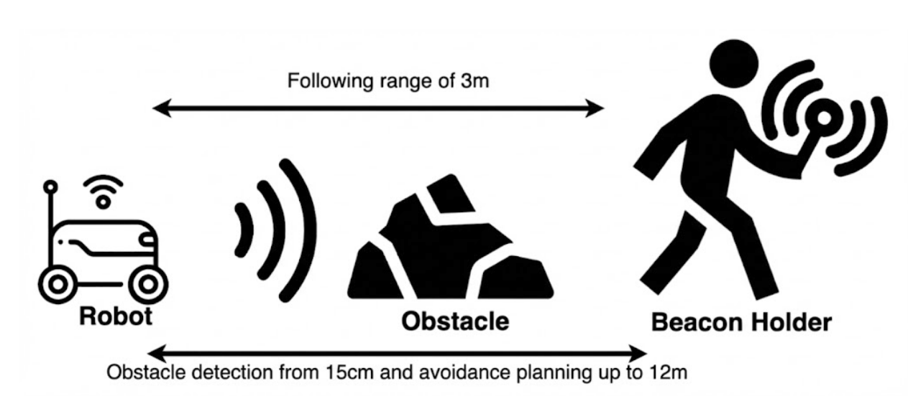

.. RoboFlock documentation master file, created by
   sphinx-quickstart on Wed Dec 17 22:54:23 2025.

RoboFlock Documentation
=======================

**The RoboFlock Project is an autonomous robot design that follows its user.** From LiDAR-based obstacle detection and GPS Real-Time Kinematic tracking to robust process management and powerful computational capabilities, RoboFlock is a reliable companion that will follow you for life (or until the battery gives out).

Previously known as Project Dust Runners, the RoboFlock Project has made a lot of changes to its design. **The goal of the RoboFlock Project is to improve obstacle detection, response time, user accessibility, and environmental resistance.** These changes will take advantage of the foundation laid by Project Dust Runners and leverage new technology to improve the design.

Overview
^^^^^^^^

This design document outlines the development and implementation of an autonomous robot system capable of navigating through dynamic and static obstacles while tracking and following a portable beacon. The primary goal of this project is to create a functional robotic platform that can follow a beacon and avoid obstacles. This project combines elements of robotic navigation, obstacle detection, and low-power management to create a practical and adaptable system.

Project RoboFlock
^^^^^^^^^^^^^^^^^

The core components of the project include the robot and the homing beacon. Together, these elements enable the robot to maintain its course toward the beacon, safely navigate around obstacles, and provide status updates on its battery health. The system's design allows it to perform reliably in outdoor settings, supporting autonomous movement within defined physical and environmental constraints.

This year's objective is to build upon the previous team’s Dust Runners into a more robust system, with an improved code base using ROS2, tracking technology, computing, and obstacle detection and navigation.

Main Changes From Alpha Design
^^^^^^^^^^^^^^^^^^^^^^^^^^^^^^

1. Tracking Technology
    * Dust Runners utilized UWB anchors and tags to calculate time of flight for distance and bearing information.
    * RoboFlock will utilize Real-Time Kinetic (RTK) GPS for centimeter level accuracy. It calculates position vector difference between a base and the robot using high precision GNSS chips for tracking the robot's global position relative to the beacon.

2. Computational Power
    * Dust Runners used a distributed system with multiple Teensy 4.1 microcontrollers for handling sensor, drive, and beacon logic.
    * RoboFlock uses a centralized Nvidia Jetson Orin Nano running ROS2 which handles perception, planning, and navigation of the robot. One Arduino will be used for motor control.

3. Obstacle Detection
    * Dust Runners used 3 ultrasonic sensors for obstacle avoidance ahead of the robot.
    * RoboFlock will use a LiDAR connected to the Jetson for longer-range obstacle detection, improved accuracy, avoidance, and planning, with the three ultrasonic sensors still being used as a fail-safe.

4. Visualization
    * Using the GPS information, we will visualize robot and beacon positions on a map of Black Rock City where Burning Man takes place to aid in retrieval of robots.  The visualization will be visible on a laptop or handlheld device.

5. Beacon Communication
    * Using Meshtastic devices we create a mesh network by which communication with the beacon will be accomplished.  This allows us to request beacon holders to return robots to the base, to communicate vital system information such as low battery levels or stuck robots, or simply send text messages to the beacon.

    Figure 1: Overview of Final Product

:doc:`Getting Started <getting_started_docs/getting_started>`
^^^^^^^^^^^^^^^^^^^^^^^^^^^^^^^^^^^^^^^^^^^^^^^^^^^^^^^^^^^^^

:doc:`Additional Information <citation_docs/additional_info>`
^^^^^^^^^^^^^^^^^^^^^^^^^^^^^^^^^^^^^^^^^^^^^^^^^^^^^^^^^^^^^

.. toctree::
   :titlesonly:
   :maxdepth: 1
   :hidden:

   getting_started_docs/getting_started
   concepts_docs/concepts
   tutorial_docs/tutorials
   codebase_docs/codebase
   hardware_docs/hardware
   construction_docs/construction
   future_considerations
   citation_docs/additional_info

